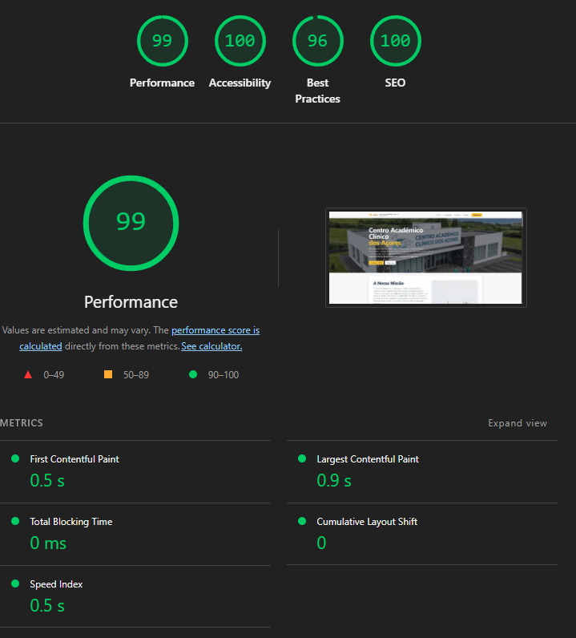

# Projeto TE1 - Fase 2 (PI2) - Landing page do Centro Académico Clínico dos Açores (CACA)

Este repositório contém o código-fonte e a documentação referente à **segunda fase (PI2)** do projeto da unidade curricular de Tecnologias Web.

A documentação da primeira fase (PI1) pode ser consultada em [README-PI1.md](./README-PI1.md).

## a) Identificação do grupo (PI2)

- Adriano Furtado Arruda - 2024111815
- Puțan Iulia Nicoleta - 2025128950
- David Jorge Repolho Cardoso - 2024108757

## b) Descrição do Projeto (Fase 2)

O objetivo principal desta fase foi a **melhoria interativa e dinâmica da landing page** do CACA, enriquecendo a experiência do utilizador através da integração de JavaScript moderno e modular.

### Funcionalidades Implementadas e Distribuição de Tarefas

#### 1. Gestão de Eventos e Interatividade (Adriano Furtado Arruda)
Implementação de componentes interativos utilizando **Classes ES6** e **Módulos JavaScript** para garantir organização e reutilização de código:
-   **Carrossel Hero (`HeroCarousel.js`):** Um carrossel de imagens na secção inicial que roda automaticamente. Utiliza `map()` para renderização dinâmica das imagens.
-   **Scroll Manager (`ScrollManager.js`):** Gestão do botão "Voltar ao Topo", que aparece suavemente após o scroll e permite uma navegação fluida.
-   **Efeito Tilt 3D (`TiltEffect.js`):** Efeito visual interativo nos cartões das áreas de investigação, que respondem ao movimento do rato criando uma perspetiva 3D.

#### 2. Formulário e Validação (Puțan Iulia Nicoleta)
Desenvolvimento de um sistema robusto de validação de formulários:
-   **Validação Client-Side:** Verificação em tempo real dos campos (Nome, Email, Assunto, Mensagem).
-   **Feedback Visual:** Mensagens de erro claras e feedback de sucesso após submissão simulada.
-   **Lógica Modular:** Implementação focada na separação de responsabilidades e tratamento de eventos de formulário.

#### 3. Animações e Bibliotecas Externas (David Jorge Repolho Cardoso)
Melhoria do apelo visual através da biblioteca **GSAP (GreenSock Animation Platform)** e **Chart.js**:
-   **Animações de Scroll (ScrollTrigger):** As secções aparecem suavemente (fade-in/slide-up) à medida que o utilizador navega.
-   **Visualização de Dados (`ChartManager.js`):** Gráfico interativo e animado que ilustra a evolução do investimento, utilizando `IntersectionObserver` para carregar apenas quando visível (performance).
-   **Contadores Estatísticos:** Animação numérica dinâmica na secção de estatísticas.

## c) Estrutura do Projeto e Tecnologias

Para esta fase, adotou-se uma estrutura de código profissional e moderna, focada na **decomposição funcional** e **normalização de nomes**:

-   **Modularização JS (ES Modules):** O código JavaScript foi dividido em módulos (`js/modules/`) importados por um ficheiro central (`js/main.js`).
-   **Arquitetura Modular CSS:** O estilo da página foi refatorado para uma abordagem modular. O ficheiro principal `style.css` atua como entry-point, importando múltiplos ficheiros específicos (ex: `header.css`, `buttons.css`, `responsive.css`) armazenados na pasta `styles/`, facilitando a manutenção e escalabilidade.
-   **Programação Orientada a Objetos (POO):** Uso de Classes para encapsular a lógica de cada componente (ex: `HeroCarousel`, `ChartManager`).
-   **Funções de Ordem Superior:** Utilização extensiva de métodos como `map`, `forEach`, `filter` e `every` para manipulação de dados e DOM.
-   **Estilo e Comentários:** Código normalizado com nomes descritivos e documentação JSDoc em inglês.

### Estrutura de Pastas:
```
/
├── assets/             # Imagens e recursos estáticos
├── styles/             # Módulos CSS separados por componente/área
│   ├── base.css
│   ├── header.css
│   ├── responsive.css
│   └── ...
├── js/                 # Código JavaScript
│   ├── modules/        # Módulos independentes (Classes)
│   │   ├── Animations.js
│   │   ├── ChartManager.js
│   │   ├── ContactForm.js
│   │   ├── HeroCarousel.js
│   │   ├── ScrollManager.js
│   │   └── TiltEffect.js
│   └── main.js         # Ponto de entrada da aplicação
├── index.html          # Estrutura HTML
├── style.css           # Entry-point CSS (importa módulos de styles/)
└── README.md           # Documentação
```

## d) Identidade Visual e Design

O nosso protótipo base (mockup) foi desenvolvido no Figma, onde definimos as escolhas estruturais e visuais. Pode ser consultado através do seguinte link:
[Figma do Projeto TE1](https://www.figma.com/design/SNOlEnaHQc2sBNPphX713Q/TE1?node-id=0-1&t=g3v6JbHW5wJggUtT-1)

---

## Benchmarking (Fase 2)

### Resultados do Benchmark



---

# TE1 Project - Phase 2 (PI2) - Azores Academic Clinical Center (CACA) Landing Page

This repository contains the source code and documentation for the **second phase (PI2)** of the Web Technologies course project.

Documentation for the first phase (PI1) can be found in [README-PI1.md](./README-PI1.md).

## a) Group Identification (PI2)

- Adriano Furtado Arruda - 2024111815
- Puțan Iulia Nicoleta - 2025128950
- David Jorge Repolho Cardoso - 2024108757

## b) Project Description (Phase 2)

The main goal of this phase was the **interactive and dynamic improvement of the CACA landing page**, enriching the user experience through the integration of modern and modular JavaScript.

### Implemented Features and Task Distribution

#### 1. Event Management and Interactivity (Adriano Furtado Arruda)
Implementation of interactive components using **ES6 Classes** and **JavaScript Modules** to ensure code organization and reusability:
-   **Hero Carousel (`HeroCarousel.js`):** An image carousel in the hero section that rotates automatically. Uses `map()` for dynamic image rendering.
-   **Scroll Manager (`ScrollManager.js`):** Management of the "Back to Top" button, which appears smoothly after scrolling and allows fluid navigation.
-   **3D Tilt Effect (`TiltEffect.js`):** Interactive visual effect on research area cards, responding to mouse movement to create a 3D perspective.

#### 2. Form and Validation (Puțan Iulia Nicoleta)
Development of a robust form validation system:
-   **Client-Side Validation:** Real-time verification of fields (Name, Email, Subject, Message).
-   **Visual Feedback:** Clear error messages and success feedback after simulated submission.
-   **Modular Logic:** Implementation focused on separation of concerns and form event handling.

#### 3. Animations and External Libraries (David Jorge Repolho Cardoso)
Improvement of visual appeal using **GSAP (GreenSock Animation Platform)** and **Chart.js**:
-   **Scroll Animations (ScrollTrigger):** Sections appear smoothly (fade-in/slide-up) as the user navigates.
-   **Data Visualization (`ChartManager.js`):** Interactive and animated chart illustrating investment evolution, using `IntersectionObserver` for lazy loading (performance).
-   **Statistical Counters:** Dynamic numerical animation in the statistics section.

## c) Project Structure and Technologies

For this phase, a professional and modern code structure was adopted, focusing on **functional decomposition** and **naming normalization**:

-   **JS Modularization (ES Modules):** JavaScript code was divided into modules (`js/modules/`) imported by a central file (`js/main.js`).
-   **CSS Modular Architecture:** The page styling was refactored into a modular approach. The main `style.css` file acts as an entry-point, importing multiple specific files (e.g., `header.css`, `buttons.css`, `responsive.css`) stored in the `styles/` folder, facilitating maintenance and scalability.
-   **Object-Oriented Programming (OOP):** Use of Classes to encapsulate the logic of each component (e.g., `HeroCarousel`, `ChartManager`).
-   **Higher-Order Functions:** Extensive use of methods like `map`, `forEach`, `filter`, and `every` for data and DOM manipulation.
-   **Style and Comments:** Normalized code with descriptive names and JSDoc documentation in English.

### Folder Structure:
```
/
├── assets/             # Images and static resources
├── styles/             # CSS Modules separated by component/area
│   ├── base.css
│   ├── header.css
│   ├── responsive.css
│   └── ...
├── js/                 # JavaScript Code
│   ├── modules/        # Independent Modules (Classes)
│   │   ├── Animations.js
│   │   ├── ChartManager.js
│   │   ├── ContactForm.js
│   │   ├── HeroCarousel.js
│   │   ├── ScrollManager.js
│   │   ├── TiltEffect.js
│   └── main.js         # Application Entry Point
├── index.html          # HTML Structure
├── style.css           # CSS Entry-point (imports modules from styles/)
└── README.md           # Documentation
```

## d) Visual Identity and Design

Our base prototype (mockup) was developed in Figma, where we defined the structural and visual choices. It can be accessed through the following link:
[TE1 Project Figma](https://www.figma.com/design/SNOlEnaHQc2sBNPphX713Q/TE1?node-id=0-1&t=g3v6JbHW5wJggUtT-1)

---

## Benchmarking (Phase 2)

### Benchmark Results


